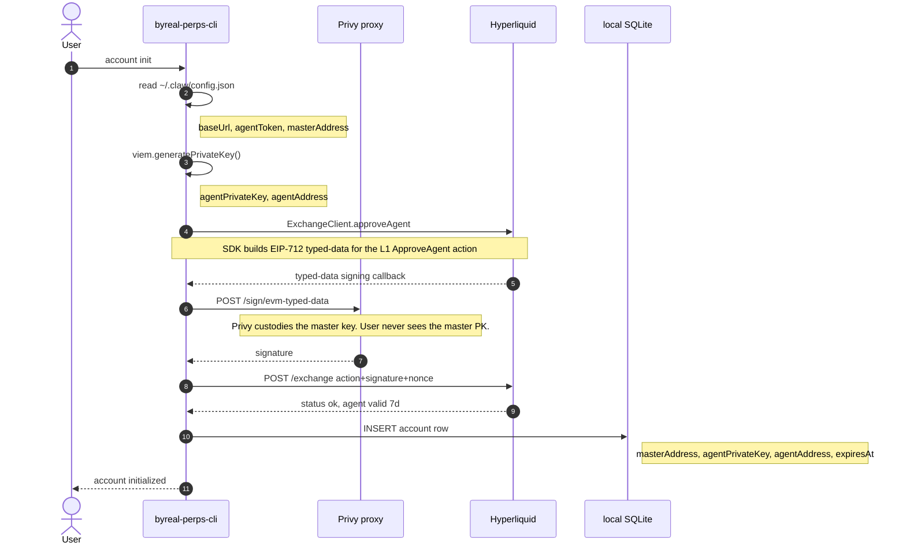
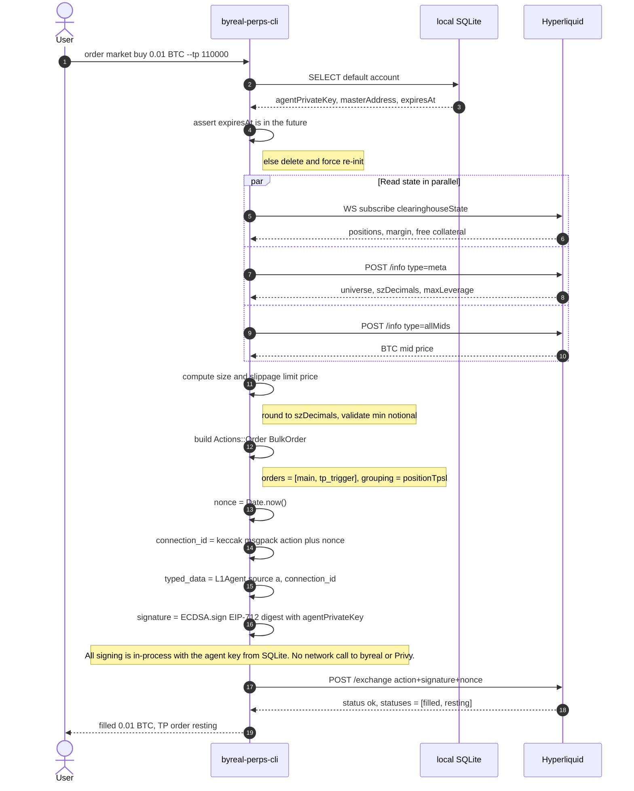
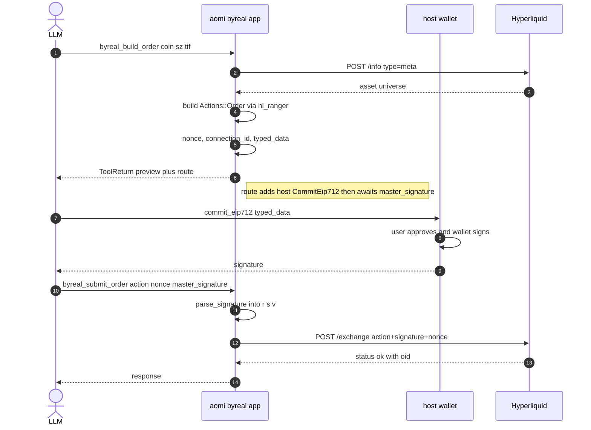

# byreal-perps-cli — sequence flows

How the byreal CLI (`byreal-perps-cli`) orchestrates its three actors: the local CLI process, byreal's Privy server-signing proxy, and Hyperliquid itself.

## Flow 1 — `account init` (server-signing path)

The only flow that touches byreal's backend. After this completes, the agent's private key lives locally and the backend is never spoken to again until the agent expires.

Key points:

- The **master key never leaves Privy's custody.** byreal's backend is a thin Privy passthrough.
- The **agent key is generated locally** by viem and never seen by the backend.
- The Privy proxy is called **exactly once** per agent (~once a week).

## Flow 2 — `order market buy` (steady state, no backend)

After init, every trading command is local-key + direct-to-Hyperliquid. byreal's backend is not involved.

Key points:

- **Zero backend dependency at trade time.** byreal's value-add is one-time onboarding via Privy, plus local-first CLI ergonomics around Hyperliquid.
- The **agent's 7-day expiry** is what forces users back through Flow 1 periodically — the only place byreal's backend matters in steady state.
- **Reads use WebSocket first, HTTP fallback.** Both go straight to Hyperliquid (never via byreal).

## How this maps to our aomi `byreal` app

Our app collapses Flow 2 into routed `build_*` / `submit_*` pairs and replaces the in-process ECDSA step with a hop through `commit_eip712` to the host wallet — same architecture, signer extracted into a separate trust domain. We deliberately skipped Flow 1 entirely (no agent approval), so today the host wallet signs every trade as if it were the master.

