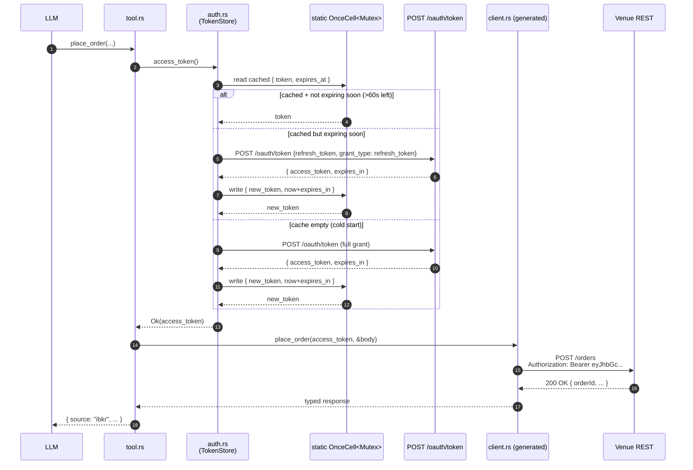
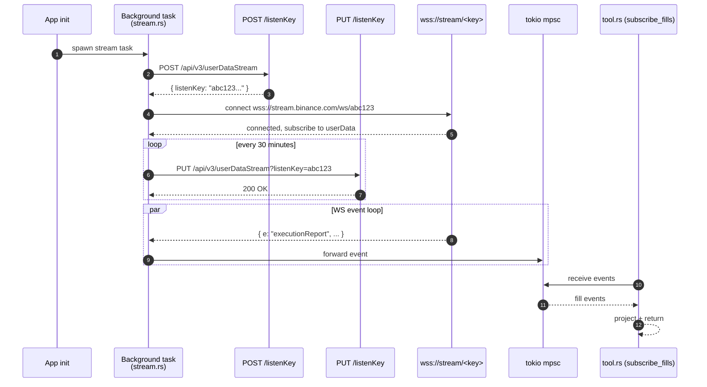
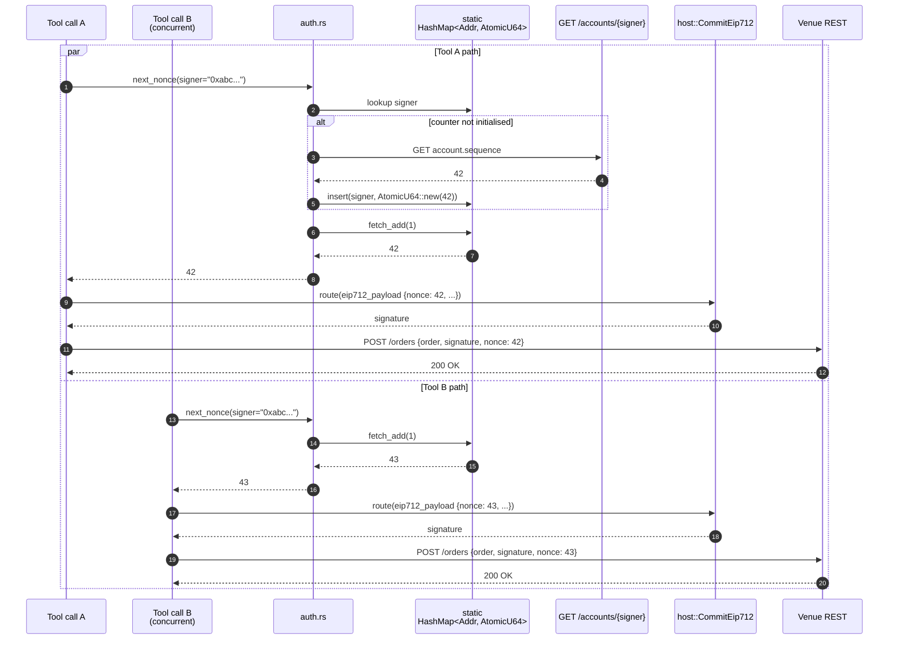
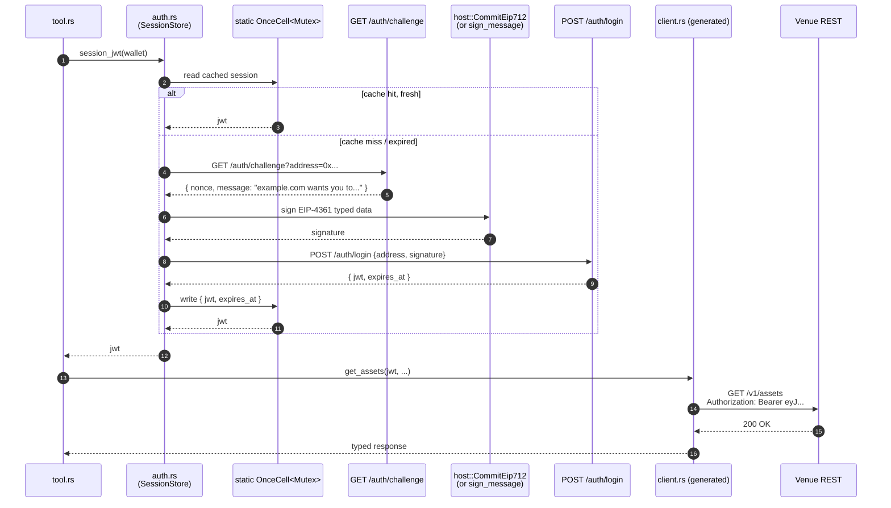
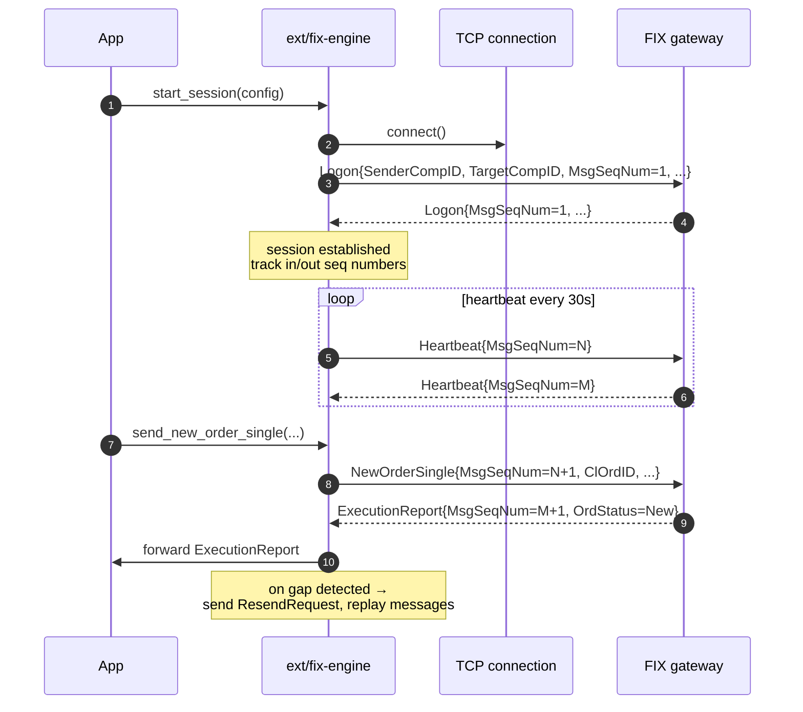

# Auth gap: stateful credentials beyond the per-call model

The patterns in [auth-practices.md](auth-practices.md) all share one assumption: **the credential the tool needs is either pre-existing (env var) or computable from the request itself (HMAC over query/body).** No state has to persist between tool calls. The shim is a pure function.

That assumption breaks down for five families of authentication that show up in trading and broader fintech APIs. This doc maps the gap, sketches the extension pattern for each, and flags which cases genuinely don't fit the shim layer at all.

If you're adding a venue and don't recognise its auth from the list in [auth-practices.md](auth-practices.md), start here — one of the gap patterns below probably matches.

## TL;DR

| Family | Examples | Fits per-call? | Extension shape |
|---|---|---|---|
| OAuth 2.0 / JWT refresh | IBKR Web API, Coinbase Prime, Robinhood, GCP SA JWT | ❌ | `TokenStore` cache in `auth.rs` |
| WebSocket `listenKey` | Binance UDS, Bybit private WS, Kraken private feed | ❌ | Background task next to `client.rs`, not in `auth.rs` |
| EIP-712 monotonic nonces | dYdX v4, Hyperliquid signed actions, some 0x flows | 🟡 | `auth::next_nonce(signer)` helper + persistence |
| SIWE / wallet-auth sessions | OpenSea, Blur, Lens, Farcaster (gated) | ❌ | `TokenStore` + EIP-4361 bootstrap via `host::CommitEip712` |
| FIX sessions | Institutional prime brokers, some CEX FIX gateways | ❌ | Separate engine crate, not REST at all |

---

## Case 1 — OAuth 2.0 / JWT with refresh tokens

**Examples**: Interactive Brokers Web API (24h session, oauth1a + bearer); Coinbase Prime (JWT, 2 min TTL — yes, two minutes); Robinhood Legend; Schwab; Galaxy; Anchorage; Google Cloud service-account JWT exchange for an `access_token`.

### The problem

The tool's authed call needs an `access_token`. To get one, you call a refresh endpoint (`POST /oauth/token` with the long-lived `refresh_token` or a signed JWT assertion). Access tokens live 15min–24h; refreshing on every tool call burns rate-limit and adds latency. Never refreshing means you fail the moment the token expires.

The credential is **stateful in process memory**: cache the token, track its expiry, refresh proactively.

### Sequence



### Extension shape

```rust
// apps/<platform>/src/auth.rs
use std::sync::Mutex;
use std::time::{Duration, Instant};
use once_cell::sync::OnceCell;

static TOKEN: OnceCell<Mutex<CachedToken>> = OnceCell::new();

struct CachedToken {
    value: String,
    expires_at: Instant,
}

const REFRESH_MARGIN: Duration = Duration::from_secs(60);

pub fn access_token() -> Result<String, String> {
    let cell = TOKEN.get_or_init(|| Mutex::new(CachedToken {
        value: String::new(),
        expires_at: Instant::now(),
    }));
    let mut guard = cell.lock().map_err(|_| "[platform] auth mutex poisoned")?;
    if guard.value.is_empty() || guard.expires_at < Instant::now() + REFRESH_MARGIN {
        let new = refresh()?;
        *guard = new;
    }
    Ok(guard.value.clone())
}

fn refresh() -> Result<CachedToken, String> {
    // POST /oauth/token with the refresh_token from env. Blocking is fine —
    // tokio::task::block_in_place inside the tool's runtime context, or use
    // a `reqwest::blocking::Client` here since refresh is rare.
    // ...
}
```

### What state needs to live where

- **In-process**: the access token + expiry. Per-process, lost on restart (acceptable; refresh happens on the first call after restart).
- **In env / SDK secrets**: the long-lived refresh token (or JWT assertion private key). Never logged, never exposed to the LLM.
- **Not needed**: nothing on disk. Cross-process sharing is intentionally avoided — it adds coordination complexity for no real benefit.

### Gotchas

- **Concurrent refresh**: the `Mutex` serializes refresh attempts. Without it, N concurrent tool calls all see "expired" simultaneously and fire N refresh requests; some venues rate-limit refresh aggressively (Coinbase Prime: 5 req/min on the token endpoint).
- **Clock skew**: if the venue's `expires_in` is relative to its server clock, leave at least 60s margin. `Instant::now()` is monotonic but the venue's deadline is wall-clock.
- **Refresh-token rotation**: some OAuth servers rotate the refresh token on every use and invalidate the old one. The cache must persist the new refresh token too — usually back to the SDK secrets store, since refresh tokens often outlive the process.

---

## Case 2 — WebSocket private streams with `listenKey`

**Examples**: Binance user data stream (`POST /api/v3/userDataStream` → 60-minute key, keep alive every ~30min); Bybit private WS; Kraken private feed (different mechanics but same shape).

### The problem

You can't subscribe to "my fills" or "my balance updates" anonymously. The venue mints a short-lived **listenKey** via a REST call; you use that key as the WS connection's auth, and you keep it alive with periodic REST pings or it gets revoked mid-stream. The credential's lifecycle is **per-connection**, not per-call, and it's coupled to a long-running background WS connection rather than any individual tool invocation.

### Sequence



### Extension shape

This **does not fit `auth.rs`**. It lives at a different layer:

```
apps/<platform>/src/
  client/          # progenitor REST client
  stream.rs       # ← new: lifecycle owner for the WS connection
  auth.rs         # static REST credentials only
  tool.rs         # tools read from stream.rs's mpsc receiver
  lib.rs
```

`stream.rs` owns:
- A tokio task spawned at app init.
- The listenKey lifecycle: mint, keep-alive timer, re-mint on disconnect.
- The WS connection with auto-reconnect + exponential backoff.
- An `mpsc::Sender` for events; tools read via the receiver.

`auth.rs` is unchanged — it still resolves the REST API key for the mint/keep-alive calls. The WS doesn't need a per-message signature.

### What state lives where

- **Background task memory**: the listenKey, the WS connection, the keep-alive timer.
- **mpsc channel**: a buffered ring of recent events for tools to consume.
- **Not in `auth.rs`**: nothing. The shim doesn't know the WS exists.

### Verdict

This is a separate concern. The shim pattern doesn't extend to it cleanly. If a venue needs streaming, plan for a `stream.rs` module alongside `client.rs` from day one. (We haven't built this yet in any Aomi app; the first venue that needs it sets the convention.)

---

## Case 3 — EIP-712 signed orders with monotonic nonces

**Examples**: dYdX v4 (Cosmos auth account sequence number — strictly monotonic); Hyperliquid signed actions (timestamp-based nonce, monotonic per signer); 0x v4 limit orders with `OrderInfo.expirationTimeSeconds | salt` shape; 1inch Fusion auctions.

**Not in scope**: Polymarket CLOB (uses random uint256 salt — collisions are cosmologically rare; nonce stays at 0 for most users), CoW Protocol (no nonce field; replay protection comes from `validTo + appData + ownerAddress` in the order UID).

### The problem

The order's EIP-712 payload includes a `nonce` field. The venue rejects two orders from the same signer with the same nonce. Some venues require **strictly monotonic** nonces (dYdX v4 — must equal account.sequence then increment); others accept any unused uint256 but in practice you want monotonicity to debug.

If two tools concurrently sign two orders, they can collide. The tool layer needs a **per-signer counter** that hands out a fresh nonce on each call.

### Sequence



### Extension shape

```rust
// apps/<platform>/src/auth.rs
use std::collections::HashMap;
use std::sync::atomic::{AtomicU64, Ordering};
use std::sync::RwLock;
use once_cell::sync::OnceCell;

static COUNTERS: OnceCell<RwLock<HashMap<String, AtomicU64>>> = OnceCell::new();

pub fn next_nonce(signer: &str) -> Result<u64, String> {
    let map = COUNTERS.get_or_init(|| RwLock::new(HashMap::new()));
    // Fast path: existing counter
    {
        let r = map.read().map_err(|_| "[platform] nonce map poisoned")?;
        if let Some(ctr) = r.get(signer) {
            return Ok(ctr.fetch_add(1, Ordering::SeqCst));
        }
    }
    // Slow path: bootstrap from venue
    let start = fetch_starting_nonce(signer)?;
    let mut w = map.write().map_err(|_| "[platform] nonce map poisoned")?;
    let ctr = w.entry(signer.to_string()).or_insert_with(|| AtomicU64::new(start));
    Ok(ctr.fetch_add(1, Ordering::SeqCst))
}

fn fetch_starting_nonce(signer: &str) -> Result<u64, String> {
    // GET /accounts/{signer} → account.sequence (dYdX) or
    // GET /user/state → nextNonce (custom venue).
    // Blocking call, runs once per (process, signer) pair.
}
```

### What state lives where

- **In-process**: per-signer counter, in a static `RwLock<HashMap>`. Process restart loses it.
- **At startup**: the seed value comes from the venue's "next valid nonce" endpoint (`GET /accounts/{addr}` for dYdX, `GET /user/state` for Hyperliquid). Bootstrap on first call per signer.
- **Cross-process**: NOT shared. If two Aomi processes serve the same signer concurrently (rare in practice) they'll race. The venue rejects the loser; the tool can retry. Persisting the high-water mark in `aomi_sdk`'s state store would solve it but adds complexity that hasn't been worth it yet.

### Verdict

Extends the pattern with one helper. The shim still owns the EIP-712 prehash (handed off to `host::CommitEip712` via the route); the tool layer calls `auth::next_nonce(signer)?` once before constructing the order. **No venue currently in `apps/` needs this** — the existing EIP-712 venues use random salts or don't have a nonce field — but dYdX v4 or Hyperliquid trading would.

---

## Case 4 — SIWE / wallet-auth sessions

**Examples**: OpenSea (POST /authenticate with SIWE → session JWT); Blur; Lens API gated endpoints; Farcaster (Hub authentication); modern web3-native data providers (Dune query exec when you bring your own wallet).

### The problem

The user signs an **EIP-4361 SIWE message** *once* with their wallet (one-time interactive step). The server returns a session JWT good for hours-to-days. Every subsequent REST call carries the JWT like a normal bearer.

It's structurally OAuth (case 1), but the bootstrap involves the host wallet rather than a refresh token. After bootstrap, identical to OAuth.

### Sequence



### Extension shape

Same `TokenStore` skeleton as case 1, plus a `bootstrap()` step that drives the host's `CommitEip712`. The bootstrap is the only new wrinkle:

```rust
// apps/<platform>/src/auth.rs
pub fn session_jwt(wallet: &str) -> Result<String, String> {
    let cell = SESSION.get_or_init(...);
    let mut guard = cell.lock().map_err(...)?;
    if guard.value.is_empty() || guard.expires_at < Instant::now() + Duration::from_secs(60) {
        *guard = bootstrap(wallet)?;
    }
    Ok(guard.value.clone())
}

fn bootstrap(wallet: &str) -> Result<CachedSession, String> {
    // 1. GET challenge
    // 2. Sign EIP-4361 via host (this is the tricky part — bootstrap runs
    //    inside a tool call but needs to dispatch a wallet route mid-flight.
    //    In practice: the FIRST authed tool returns a ToolReturn::route that
    //    signs the SIWE message, and the after-step caches the JWT and
    //    re-invokes the original tool. This is more elaborate than OAuth.)
    // 3. POST /auth/login
    // 4. Build CachedSession
}
```

### What state lives where

- **In-process**: the JWT + expiry. Same cache as OAuth.
- **Bootstrap-time**: requires a wallet signature, which is a routed step. The first authed call therefore has an extra hop.
- **Not needed**: a long-lived refresh token. The wallet IS the refresh credential — re-bootstrap requires another signature.

### Verdict

Same `TokenStore` infrastructure as case 1, but the cold-start path routes through `host::CommitEip712`. Implementable but more elaborate than OAuth — the bootstrap can't happen synchronously inside the shim function because wallet signing is async / interactive. The cleanest version uses a routed `ToolReturn` for the first tool call per session.

---

## Case 5 — FIX sessions

**Examples**: institutional prime brokers, Coinbase Prime FIX, Galaxy, Binance Institutional FIX gateway, most equities prime brokers.

### The problem

FIX is a long-lived TCP session with bi-directional monotonically-increasing sequence numbers, heartbeats, gap-detection, resend logic, and session-level Logon/Logout messages. The "credential" is the established session, not any header. It's not REST.

### Sequence (illustrative)



### Extension shape

**Not part of the shim pattern at all.** FIX needs a dedicated state-machine engine:

- **A separate crate**, e.g. `ext/fix-engine/`. Likely wrapping an existing Rust FIX library (`fefix`, `quickfix-rs`) or QuickFIX/J via JNI for parity with the industry.
- The crate exposes a high-level async interface: `submit_order(...)`, `cancel_order(...)`, `subscribe_executions()`.
- Aomi apps that wrap FIX venues use this engine instead of progenitor + an HTTP client. The tool layer looks similar (resolve credentials, build typed message, call engine) but the underlying transport is completely different.

### What state lives where

- **In the engine**: TCP socket, in/out sequence numbers, replay buffer, heartbeat timer, session state machine.
- **On disk (recommended)**: outbound sequence number, ClOrdID counter — so reconnecting after a crash doesn't lose synchronization with the venue.
- **In env / SDK secrets**: SenderCompID, TargetCompID, optional Logon password.

### Verdict

Out of scope for `auth.rs` and the shim pattern. If we ever integrate a FIX venue, it's a parallel-track project: write the engine first, then wrap individual venues thinly on top.

---

## Decision tree for a new venue

1. **Does the venue use static or per-request credentials?** → see [auth-practices.md](auth-practices.md).
2. **Does it issue short-lived tokens that need refreshing?**
   - Refresh via long-lived token → case 1 (OAuth/JWT). Extend with `TokenStore`.
   - Refresh via wallet signature → case 4 (SIWE). Same store + EIP-712 bootstrap.
3. **Does it offer private WS streams?** → case 2. Plan for `stream.rs` next to `client.rs`.
4. **Does it have monotonic per-signer nonces in the order payload?** → case 3. Add `auth::next_nonce(signer)`.
5. **Is it FIX over TCP, not REST?** → case 5. Separate engine crate.
6. **Multiple of the above?** Compose them — they're orthogonal. E.g. dYdX v4 = case 3 (nonces) + future case 1 (when they add OAuth to indexer endpoints).

## What we have today

| Aomi app | Auth | Stateful? | Case |
|---|---|---|---|
| binance / bybit / okx | Per-request HMAC | No | (covered) |
| limitless | Per-request HMAC (newline prehash) | No | (covered) |
| krexa | Static `X-API-Key` | No | (covered) |
| **No app yet** | OAuth / JWT refresh | Yes | Case 1 |
| **No app yet** | WS private streams | Yes | Case 2 |
| polymarket | EIP-712 (random salt, nonce=0) | Weakly | Case 3 (uses random salt, no counter needed) |
| cow | EIP-712 (no nonce) | No | — (validTo + appData handle replay) |
| hyperliquid | Read-only (no signing) | No | — |
| **No app yet** | SIWE / wallet-auth session | Yes | Case 4 |
| **No app yet** | FIX | Yes | Case 5 |

The gap doc exists ahead of demand — when the first OAuth or WS venue lands, the recipe is already written down.
