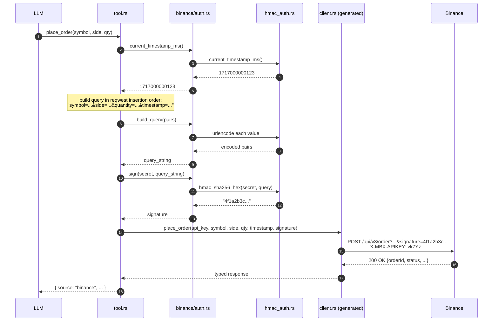
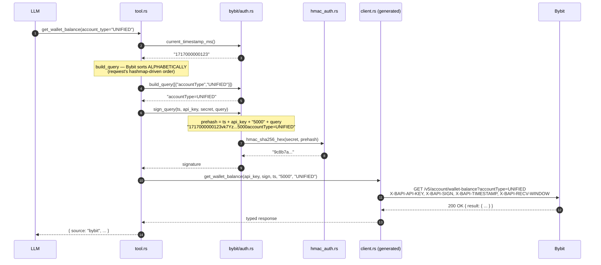
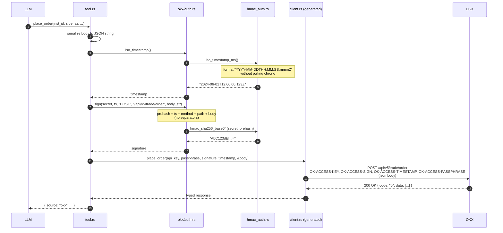

# Auth practices for Aomi apps

Reference for how each integrated venue authenticates and how the per-app `auth.rs` shim implements it. Every Aomi app that talks to an authed external API follows the same overall pattern; the differences are in **what to concatenate** before hashing, **how to encode** the result, and **where to put it** on the wire.

This doc is the deep-dive that the [`aomi-app-ux-tool-maker`](../.claude/skills/aomi-app-ux-tool-maker/SKILL.md) skill links to. Use it when adding a new authed venue (need a recipe to copy) or when debugging a 401 from an existing one.

## TL;DR — the contract

1. **Auth is per-call, never global.** No reqwest middleware, no globally-authed client. The tool layer resolves the secret per call and passes the resulting headers/signatures positionally into the progenitor-generated client method.
2. **Crypto primitives are shared.** All HMAC / base64 / hex / timestamp / urlencode lives in [`ext/src/hmac_auth.rs`](../ext/src/hmac_auth.rs) (feature-gated as `aomi-ext/hmac-auth`). Per-app `auth.rs` files own only venue-specific *composition* — what to concatenate before signing, in what order, with what separators.
3. **Header parameters must be in the spec's `parameters:`**, not just `securitySchemes:`. Progenitor only generates positional arguments for entries in `parameters:`. Without that declaration the generated client has nowhere for the key/signature to plug in.

## Comparison matrix

| Venue | File | Where the key goes | Where the signature goes | Prehash format | HMAC output | Other headers / quirks |
|---|---|---|---|---|---|---|
| **Binance** | [ext/src/binance/auth.rs](../ext/src/binance/auth.rs) | `X-MBX-APIKEY` header | `signature` **query param** | `query_string` (the rest of the query, URL-encoded) | hex | `timestamp` also a query param |
| **Bybit** | [ext/src/bybit/auth.rs](../ext/src/bybit/auth.rs) | `X-BAPI-API-KEY` header | `X-BAPI-SIGN` header | `ts + apikey + recv + payload` (no separators) | hex | `X-BAPI-TIMESTAMP`, `X-BAPI-RECV-WINDOW=5000`, alphabetical query order |
| **OKX** | [ext/src/okx/auth.rs](../ext/src/okx/auth.rs) | `OK-ACCESS-KEY` header | `OK-ACCESS-SIGN` header | `ts + method + requestPath + body` (no separators) | base64 | `OK-ACCESS-TIMESTAMP` (ISO-8601 ms, not unix), `OK-ACCESS-PASSPHRASE` |
| **Limitless** | [apps/limitless/src/auth.rs](../apps/limitless/src/auth.rs) | `lmts-api-key` header | `lmts-signature` header | `ts \n method \n path \n body` (newline separators) | base64 | secret is itself base64 — decode before use as HMAC key |
| **Krexa / static bearer** | [apps/krexa/src/auth.rs](../apps/krexa/src/auth.rs) | `X-API-Key` header | — (no signature) | — (no prehash) | — | env var only, no crypto |

The four HMAC venues all use HMAC-SHA256; only the prehash, the output encoding, and the wire location differ.

---

## Binance — sign the query, send hex in the URL

Binance is the simplest signed-trading venue: **the prehash IS the URL-encoded query string** (everything except the signature itself), HMAC-SHA256 with the secret, hex-encoded, then *appended back into the query* as `&signature=...`. The API key rides as a header.

### Wire-level example

`POST` to `/api/v3/order` with these parameters:

```
symbol=BTCUSDT
side=BUY
type=MARKET
quantity=0.01
timestamp=1717000000123
```

Build the query string in insertion order (reqwest preserves it):

```
symbol=BTCUSDT&side=BUY&type=MARKET&quantity=0.01&timestamp=1717000000123
```

Compute `signature = HMAC-SHA256(secret, query).hex()`. Result is a 64-char lowercase hex string.

Final wire request:

```
POST /api/v3/order?symbol=BTCUSDT&side=BUY&type=MARKET&quantity=0.01&timestamp=1717000000123&signature=4f1a2b3c... HTTP/1.1
Host: api.binance.com
X-MBX-APIKEY: vk7Yz...
```

### Sequence



### Why this shape

- **Signature in the query, not a header.** Binance predates the HMAC-in-header convention; whatever the URL says is what the server hashes. Keeping the signature in the query means the entire signed payload is in one byte-identical string.
- **Insertion order matters.** Binance signs the literal payload it sees on the wire. reqwest's `.query(...)` emits params in insertion order, so the per-app `build_query` preserves that — re-ordering would break the signature even though the params are identical.
- **`X-MBX-APIKEY` is just routing.** The key identifies *which* account; the signature proves *who*. Server validates that `HMAC(account_secret, query) == signature`.

### What `auth.rs` owns (46 lines)

```rust
pub fn sign(secret_key: &str, query_string: &str) -> Result<String, String>
pub fn current_timestamp_ms() -> Result<i64, String>
pub fn urlencode(s: &str) -> String
pub fn build_query(pairs: &[(&str, Option<String>)]) -> String
```

Everything below the surface — HMAC, hex, urlencode rules, timestamp — is shared. The shim just exposes Binance-shaped wrappers and chooses *insertion order* for `build_query`.

---

## Bybit — concat with the API key + recv window, send hex in headers

Bybit packs the timestamp, API key, recv window, and request payload into one concatenated string with **no separators**, HMACs it, hex-encodes it, and ships it in `X-BAPI-SIGN`. The whole authentication is in headers; the URL stays clean.

### Wire-level example

`GET /v5/account/wallet-balance?accountType=UNIFIED`:

- Timestamp: `1717000000123`
- API key: `vk7Yz...`
- Recv window: `5000` (hardcoded constant)
- Payload (GET request): the query string `accountType=UNIFIED`

Concat:

```
1717000000123vk7Yz...5000accountType=UNIFIED
```

`signature = HMAC-SHA256(secret, prehash).hex()` → 64-char hex.

Final wire:

```
GET /v5/account/wallet-balance?accountType=UNIFIED HTTP/1.1
Host: api.bybit.com
X-BAPI-API-KEY: vk7Yz...
X-BAPI-SIGN: 9c8b7a...
X-BAPI-TIMESTAMP: 1717000000123
X-BAPI-RECV-WINDOW: 5000
```

For POSTs the payload is the **raw JSON body string** instead of the query string. Re-serializing the body before signing produces a different signature than the server computes (keys may sort differently), so the tool layer must sign **the exact byte string** it sends.

### Sequence



### Why this shape

- **API key in the prehash.** Including the key prevents an attacker who knows the secret from forging a signature for a different account's key.
- **recv_window in the prehash.** Server uses recv_window to decide whether the request is fresh; including it in the signed payload prevents an attacker from extending the window after-the-fact.
- **Alphabetical query order.** Bybit's V5 spec doesn't *mandate* alphabetical, but reqwest emits hashmap-keyed params alphabetically. The per-app `build_query` sorts to match, so the prehash is byte-identical to the wire query.
- **`RECV_WINDOW = "5000"` hardcoded.** Bybit's recommended default. Customizing is pointless complexity unless you're optimizing for one specific deployment.

### What `auth.rs` owns (78 lines)

```rust
pub const RECV_WINDOW: &str = "5000";
pub fn current_timestamp_ms() -> String
pub fn sign_query(ts: &str, api_key: &str, secret: &str, query: &str) -> String
pub fn sign_body(ts: &str, api_key: &str, secret: &str, body: &str) -> String
pub fn build_query(pairs: &[(&str, Option<&str>)]) -> String   // alphabetical!
fn sign_payload(...)  // shared helper for sign_query/sign_body
```

`sign_query` and `sign_body` look symmetric because they are — Bybit's prehash format treats the GET query and POST body identically. Two functions exists for self-documentation.

---

## OKX — concat with method + path + body, send base64 in headers, ISO-8601 timestamp

OKX requires **four** headers: key, signature, timestamp, and a third secret (the *passphrase*, set when the key is created in the dashboard). The prehash is `timestamp + method + requestPath + body` — no separators — and the output is base64, not hex.

### Wire-level example

`POST /api/v5/trade/order` with JSON body:

```json
{"instId":"BTC-USDT","tdMode":"cash","side":"buy","ordType":"market","sz":"0.001"}
```

- Timestamp: ISO-8601 UTC with ms precision → `2024-06-01T12:00:00.123Z`
- Method: `POST`
- requestPath: `/api/v5/trade/order` (includes query if any)
- Body: the JSON string above

Concat (no separators):

```
2024-06-01T12:00:00.123ZPOST/api/v5/trade/order{"instId":"BTC-USDT",...}
```

`signature = base64(HMAC-SHA256(secret, prehash))` → 44-char base64 string ending in `=`.

Final wire:

```
POST /api/v5/trade/order HTTP/1.1
Host: www.okx.com
Content-Type: application/json
OK-ACCESS-KEY: vk7Yz...
OK-ACCESS-SIGN: AbC123dEf...=
OK-ACCESS-TIMESTAMP: 2024-06-01T12:00:00.123Z
OK-ACCESS-PASSPHRASE: <user-defined-string>

{"instId":"BTC-USDT","tdMode":"cash","side":"buy","ordType":"market","sz":"0.001"}
```

### Sequence



### Why this shape

- **Three credentials, not two.** The passphrase is set client-side at key creation; the server stores its hash. An attacker who steals just the API key + secret can't sign requests without it. Defense in depth at the cost of one more env var.
- **ISO-8601 timestamp.** Unusual — most venues use unix-ms. The choice is documented in OKX's spec and the per-app shim formats it without chrono (via the shared `iso_timestamp_ms` algorithm in `hmac_auth.rs`).
- **`requestPath` includes query string.** For GETs the prehash becomes e.g. `ts + "GET" + "/api/v5/market/ticker?instId=BTC-USDT" + ""`. The body is `""` for GETs.
- **base64, not hex.** Smaller on the wire (44 vs 64 chars), still ASCII-safe in a header.

### What `auth.rs` owns (40 lines)

```rust
pub fn sign(secret, ts, method, request_path, body) -> Result<String, String>
pub fn iso_timestamp() -> String
```

Just two functions. The shim is so small because OKX's prehash format is the most "regular" of the HMAC venues — no key inclusion, no fixed recv window, no quirky sort order. Everything else is shared.

---

## Krexa / Aomi-style static `X-API-Key` — env in, header out

No HMAC, no timestamp, no passphrase. Just a `kx_`-prefixed key (issued out-of-band) carried as the `X-API-Key` header on every request that needs it. The shim is one function.

### Wire-level example

`POST /api/v1/solana/paysh/<agent>/call`:

```
POST /api/v1/solana/paysh/Ag3nt.../call HTTP/1.1
Host: api.krexa.xyz
Content-Type: application/json
X-API-Key: kx_abc123def...

{"targetUrl":"https://gemini.paysh.dev/v1/generate","ownerAddress":"...","useCredit":true}
```

### Sequence

```mermaid
sequenceDiagram
    autonumber
    participant LLM
    participant Tool as tool.rs
    participant Auth as krexa/auth.rs
    participant Env as KREXA_API_KEY
    participant Client as client.rs (generated)
    participant API as Krexa

    LLM->>Tool: pay_api_call(agent, target_url, ...)
    Tool->>Auth: api_key()
    Auth->>Env: std::env::var("KREXA_API_KEY")
    alt key set
        Env-->>Auth: "kx_abc123def..."
        Auth-->>Tool: Ok(key)
    else key missing
        Env-->>Auth: VarError
        Auth-->>Tool: Err("[krexa] KREXA_API_KEY not set; ...")
        Tool-->>LLM: error surfaced via ? propagation
    end
    Note over Tool: build PayshCallRequest body
    Tool->>Client: paysh_call(agent, api_key, &body)
    Client->>API: POST /api/v1/solana/paysh/<agent>/call<br/>X-API-Key: kx_abc...<br/>{json body}
    API-->>Client: 200 OK { paymentRequired, transaction, ... }
    Client-->>Tool: typed response
    Tool-->>LLM: { source: "krexa", ... }
```

### Why this shape

- **The key already proves identity.** Krexa rotates and revokes keys server-side; no need for client-computed proof. Trade-off: a stolen key is fully usable until rotated. That's why Krexa scopes keys (per-agent) and rate-limits them.
- **No crypto in the shim.** Adding HMAC complexity here would be ceremony without security gain — the server can't distinguish a stolen-key attack from a legitimate request either way.
- **Env var pattern.** Standardised as `<PLATFORM>_API_KEY`. The shim returns `Result<String, String>` so anonymous tools (most of Krexa's surface) don't pay the resolution cost and only the authed-write tools propagate the error.

### What `auth.rs` owns (32 lines)

```rust
pub const API_KEY_ENV: &str = "KREXA_API_KEY";
pub fn api_key() -> Result<String, String>
```

This is the floor of the pattern. Anything smaller and you should question whether you need a shim at all — for fully public APIs, skip `auth.rs` entirely.

---

## Decision guide for a new venue

When adding a new authed venue, ask in order:

1. **Does the venue do any client-side crypto?**
   - No → use the Krexa / static-bearer pattern. Shim is one env-resolver function.
   - Yes → continue.

2. **Is the algorithm HMAC-SHA256?** (95% of REST venues — Binance, Bybit, OKX, Limitless, KuCoin, Gate.io, …)
   - Yes → pull in `aomi-ext`'s `hmac-auth` feature and write a thin shim that calls `hmac_sha256_hex` / `hmac_sha256_base64`. Use one of the existing four venues' `auth.rs` as a template.
   - No (Ed25519, RSA, custom) → write the primitive in a new shared module under `ext/src/` (e.g. `ext/src/ed25519_auth.rs`) if it's reusable, or keep it in the per-app shim if it's truly one-off.

3. **What goes in the prehash?** Read the venue's official auth docs and write down the literal concatenation, byte for byte. Match an existing venue if possible:
   - Just the query string → Binance pattern.
   - `ts + api_key + extra + payload` → Bybit pattern.
   - `ts + method + path + body` → OKX pattern.
   - Newline-separated → Limitless pattern.

4. **Where does the signature go on the wire?**
   - Header → declare it as a `parameters:` entry in the spec so progenitor emits it as a positional arg.
   - Query param → ditto, but with `in: query`.
   - Body field → either declare it in the request body schema or sign the body the tool layer constructs before the call.

5. **How is the result encoded?**
   - hex → `hmac_sha256_hex`
   - base64 (standard alphabet, padded) → `hmac_sha256_base64`
   - base64url → no shared helper yet; add one to `hmac_auth.rs` when first needed.

6. **What's the timestamp format?**
   - Unix ms (most venues) → `current_timestamp_ms()`
   - ISO-8601 ms (OKX, Limitless) → `iso_timestamp_ms()`
   - Unix seconds → multiply or add a helper to `hmac_auth.rs`.

7. **Any quirks?** Document them in the shim's file-level doc comment. The existing four files are good examples — they explicitly call out *why* the file exists and what differs from the other venues. That doc trail is the audit log for future-you.

## Anti-patterns recap

- ❌ Globally-configured auth via reqwest middleware. Breaks per-call resolution.
- ❌ Declaring auth only under `securitySchemes:`. Progenitor ignores it.
- ❌ Reimplementing HMAC, base64, or timestamp formatting in a per-app shim. Use `hmac_auth.rs`.
- ❌ Exposing the secret as an LLM-callable tool argument. The LLM should never see it.
- ❌ Mutating the body / query between sign and send. The signature is over the literal byte string on the wire.
- ❌ Writing an `auth.rs` for a fully public API. Skip it; less code is better.

## Files referenced

- [ext/src/hmac_auth.rs](../ext/src/hmac_auth.rs) — shared primitives
- [ext/src/binance/auth.rs](../ext/src/binance/auth.rs) — query-string HMAC, hex
- [ext/src/bybit/auth.rs](../ext/src/bybit/auth.rs) — header HMAC with ts+key+recv prehash
- [ext/src/okx/auth.rs](../ext/src/okx/auth.rs) — 4-header HMAC with ISO-8601 timestamp
- [apps/limitless/src/auth.rs](../apps/limitless/src/auth.rs) — newline-separated prehash, base64-decoded secret
- [apps/krexa/src/auth.rs](../apps/krexa/src/auth.rs) — static `X-API-Key` bearer
